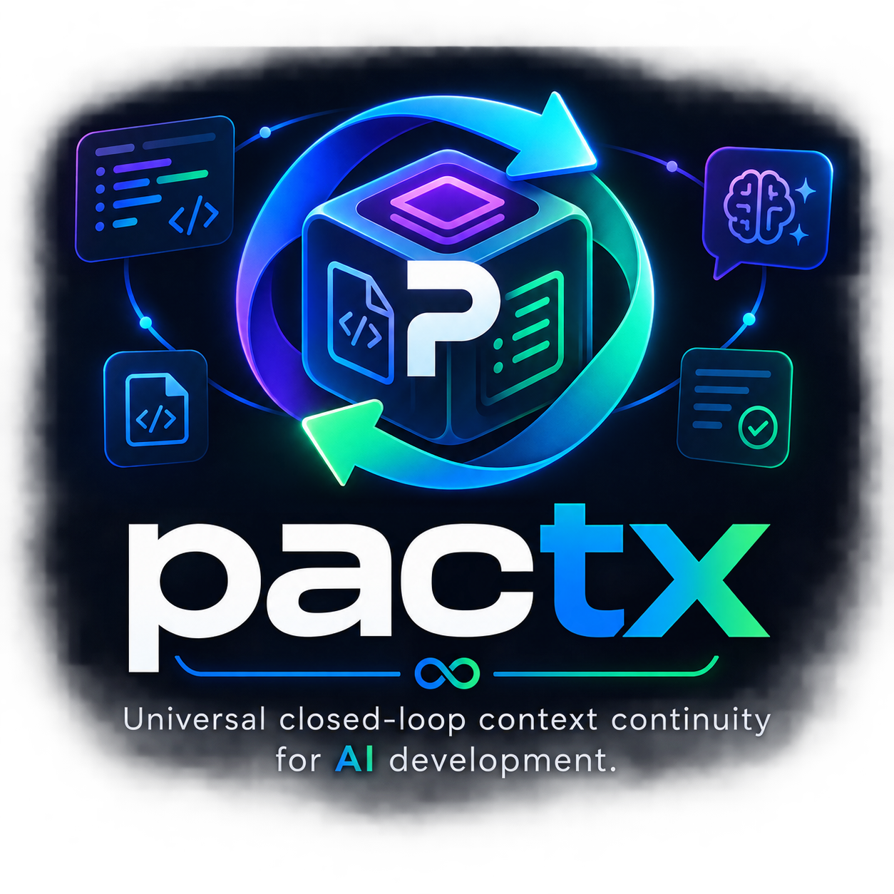

<p align="center">
  
</p>

# pactx 📦

> **Universal closed-loop context continuity & handoff engine for AI-assisted software development.**  
> Keep your AI aligned across chats, models, and sessions without context degradation or manual state maintenance.

🌐 **Language / Idioma:** [English](./README.md) | [Português (Brasil)](./README.pt-BR.md)

[](https://www.npmjs.com/package/@trsthales/pactx)
[](https://opensource.org/licenses/MIT)

---

## The Problem: The "AI Amnesia & Context Drift"

Long chat sessions suffer from context window degradation, hallucinations, and loss of constraints. When switching between chats or models (ChatGPT ⇄ Claude ⇄ Gemini ⇄ Cursor), asking an AI with context rot to *"summarize what we did"* results in missed decisions, repeated mistakes, and wasted tokens.

**LLMs are stateless compute engines. Your project is persistent state.**

---

## The Solution: `pactx` Closed-Loop Memory

`pactx` turns your repository into the **canonical source of truth** and creates a **bidirectional bridge** between your codebase and any AI model.

```text
┌────────────────────────────────────────────────────────────────────────┐
│                          YOUR REPOSITORY                               │
│      .ai-context/ (project, state, active ADRs, glossary)              │
│      + Git Runtime State (branch, recent commits, modified files)      │
└──────────────────┬──────────────────────────────────▲──────────────────┘
                   │                                  │
      1. npx @trsthales/pactx │        3. npx @trsthales/pactx │ update
         (Egress)  │                        (Ingress) │ (Human-in-the-Loop)
                   ▼                                  │
    ┌──────────────────────────────┐   ┌──────────────┴──────────────────┐
    │  📋 Token-Optimized Context  │   │  📦 Structured pactx-update     │
    │     (Copied to Clipboard)    │   │     (ADRs, Facts, Hypotheses)   │
    └──────────────┬───────────────┘   └──────────────▲──────────────────┘
                   │                                  │
                   ▼                                  │ 2. /handoff
    ┌─────────────────────────────────────────────────┴──────────────────┐
    │               ANY AI (ChatGPT / Claude / Gemini / Cursor)          │
    └────────────────────────────────────────────────────────────────────┘
```

1. **Egress (`pactx` / `pack`):** Inspects project specs, active ADRs, and Git delta to generate a clean, token-efficient Markdown context pack.
2. **Ingress (`pactx update`):** Ingests the AI's structured handoff block, validates schema and security rules, presents a full-text review, and atomically persists decisions, facts, and tasks directly into `.ai-context/`.

---

## Quickstart

No global installation required:

### 1. Initialize `.ai-context/` in your repository
```bash
npx @trsthales/pactx init
```

This scaffolds the canonical directory structure:
```text
.ai-context/
├── project.md      # Static identity, stack, and non-negotiable rules
├── requirements.md # Canonical requirements & business rules (REQ-001)
├── state.md        # Active task, facts, blockers, rejected hypotheses
├── glossary.md     # Invariant contracts, table names, domain terms
└── decisions/      # Versioned micro-ADRs (DEC-001.md)
```

### 2. Pack Context & Start Session (1 Second)
```bash
npx @trsthales/pactx
```
Output:
```text
✔ Context packed successfully!
📋 Copied to clipboard!
Size: 1.45 KB | ~380 tokens

👉 Paste directly into ChatGPT, Claude, Gemini, or your coding agent!
```
Paste (`Ctrl+V`) into any AI chat. The AI will immediately understand the exact task, active architecture, invariant rules, and discarded hypotheses.

### 3. Close the Loop & Persist State
When finishing a task or before switching chats, ask the AI:
> `"/handoff"` *(or "Generate the pactx-update block")*

Copy the AI's response and run in your terminal:
```bash
npx @trsthales/pactx update
```

Interactive Review UI:
```text
📦 pactx-update block detected!

Canonical Mutation Plan:
────────────────────────────────────────────────────────────────────────────
📝 .ai-context/state.md
   • Active Task: "TASK-05 Login de Alunos via PIN" [IN_PROGRESS]
   • Next Action: "Implementar validação do StudentPIN no authController"
   • [+] Fact: "Rate limit de login por PIN deve ser restrito a 5 tentativas por minuto"
   • [+] Discarded Hypothesis: "O login de alunos NÃO deve exigir e-mail ou senha"
📋 .ai-context/requirements.md [CREATE]
   • [REQ-002] "Student PIN Security Policy" (functional)
     Statement: "Alunos devem se autenticar através de PIN de 4 dígitos com rate limit restrito."
🏛️  .ai-context/decisions/DEC-002.md [CREATE]
   • Title: "Autenticação de Alunos via PIN Numérico de 4 Dígitos"
   • Satisfies: REQ-002
   • Decision: "Utilizar combinação de Turma + PIN com hash seguro no PostgreSQL"
📖 .ai-context/glossary.md [APPEND]
   • StudentPIN: "Código numérico de 4 dígitos atribuído ao aluno"
────────────────────────────────────────────────────────────────────────────

? Apply canonical changes to repository? (Y/n) y

✔ Canonical state updated successfully!
📋 Audit ledger recorded in .ai-context/.pactx/ledger.json
```

---

## The `pactx-update` Protocol Schema (v1.1)

AIs emit the candidate update block wrapped in the `pactx-update` code fence:

````yaml
```pactx-update
version: "1.1"
base_revision: "2a0de5"

source:
  type: "conversation" # conversation | agent | manual | document
  model: "Gemini 1.5 Pro"
  session_topic: "Implementação da autenticação por PIN"

state:
  active_task: "TASK-05 Login de Alunos via PIN"
  status: "IN_PROGRESS" # IN_PROGRESS | BLOCKED | COMPLETED
  recommended_model: "Medium" # Medium | High
  completed_items:
    - "Definição do fluxo de autenticação por PIN"
  new_facts:
    - "Rate limit de login por PIN restrito a 5 tentativas por minuto"
  rejected_hypotheses:
    - "O login de alunos NÃO deve exigir e-mail ou senha alfanumérica"
  next_action: "Implementar validação no controller e aplicar rate limit"

new_requirements:
  - id: "auto" # automatically generates REQ-002
    type: "functional" # functional | security | performance | compliance
    title: "Student PIN Security Policy"
    statement: "Alunos devem se autenticar através de PIN de 4 dígitos com rate limit restrito."

new_decisions:
  - id: "auto" # pactx automatically calculates next sequence (DEC-002)
    title: "Autenticação de Alunos via PIN Numérico de 4 Dígitos"
    reason: "Alunos do ensino fundamental possuem fricção com senhas complexas"
    decision: "Utilizar Turma + PIN de 4 dígitos com hash seguro"
    satisfies: ["REQ-002"]

superseded_decisions:
  - id: "DEC-001"
    by: "auto" # or specific ID
    reason: "Substituída pelo novo modelo de multi-tenancy"

new_glossary_terms:
  - term: "StudentPIN"
    definition: "Código numérico de 4 dígitos atribuído ao aluno"
```
````

---

## CLI Reference

### Core Commands
| Command / Flag | Description |
|---|---|
| `pactx` / `pactx pack` | Reads repository state, copies context pack to clipboard, and prints stats |
| `pactx init` | Scaffolds the `.ai-context/` directory with templates |
| `pactx status` | Displays visual executive cognitive memory dashboard and git runtime state |
| `pactx status --json` | Emits full structured status as machine-readable JSON |
| `pactx diff` | Inspects and displays color-coded mutation plan without writing to disk |
| `pactx diff --file <path>` | Inspects mutation plan from a specific file |
| `pactx diff --stdin` | Inspects mutation plan piped from stdin |
| `pactx rollback [hash]` | Graph-safe & WAL-protected rollback of latest transaction (LIFO) or specific hash |
| `pactx rollback --force-cascade` | Automatically cascades rollback across all dependent subsequent transactions |
| `pactx doctor` | Validates repository health against 8 integrity and consistency rules |
| `pactx doctor --fix` | Automatically repairs stale locks, cleans orphan temps, and prunes expired records |

### Ingestion Commands (`pactx update`)
| Command / Flag | Description |
|---|---|
| `pactx update` | Reads clipboard, validates payload, displays full-text plan, and prompts for confirmation |
| `pactx update -y`, `--yes` | Applies changes without interactive confirmation (strictly keeps all safety & schema validations) |
| `pactx update --dry-run` | Simulates and displays the full mutation plan without writing to disk |
| `pactx update --file <path>` | Reads the `pactx-update` block from a markdown or log file |
| `pactx update --stdin` | Reads the block via pipe (`cat response.md \| pactx update --stdin`) |

---

## Enterprise Safety & Zero-Trust Architecture

`pactx update` treats AI outputs as **untrusted candidate input**:

1. **Write-Ahead Logging (WAL):** Multi-file writes are orchestrated through atomic WAL manifests (`PREPARED` -> `APPLYING` -> `COMMITTED` / `ROLLED_BACK`). Crashes automatically trigger boot auto-recovery.
2. **Path Traversal Jail:** ADR and Requirement identifiers are strictly constrained to `/^(auto|DEC-\d{3,4}|REQ-\d{3,4})$/i`. File writes cannot escape `.ai-context/`.
3. **Safe AST Serialization:** Zero naive string template interpolation for YAML. All frontmatter is safely generated via formal YAML dumpers.
4. **Graph-Safe Dependency Rollbacks:** Rollbacks analyze downstream links (`satisfies`, `superseded_by`) and prevent inconsistent states.
5. **Canonical Idempotency:** Payloads are hashed with SHA-256 into `.ai-context/.pactx/ledger.json`. Re-running the same clipboard results in a safe No-Op.
6. **Anti-Poisoning Full-Text Review:** The terminal displays the full literal text of every incoming decision, requirement, fact, and hypothesis before prompting for human approval.

---

## Directory Specification (`.ai-context/`)

```text
.ai-context/
├── project.md            # Vision, technology stack, and invariant rules
├── requirements.md       # Canonical requirements & business rules (REQ-001)
├── state.md              # Active task, completed items, facts, and rejected hypotheses
├── glossary.md           # Domain terms, API contracts, and entity definitions
├── decisions/
│   ├── DEC-001.md        # Active or superseded ADRs with structural lineage & satisfies links
│   └── DEC-002.md
└── .pactx/
    ├── ledger.json       # Audit ledger tracking applied SHA-256 update hashes
    ├── .pactx.lock       # Atomic concurrency lockfile
    └── transactions/     # Write-Ahead Log (WAL) manifests (TX-<hash>.json)
```

---

## Documentation

- 📖 **[Step-by-Step Tutorial](./docs/TUTORIAL.md)** — Practical guide on how to integrate and use `pactx` in your daily workflow.
- 🏛️ **[Technical & Architecture Spec](./docs/ARCHITECTURE.md)** — Deep dive into the closed-loop engine, security jail, and transactional guarantees.

---

## License

Distributed under the **MIT** License. See [`LICENSE`](./LICENSE) for more information.